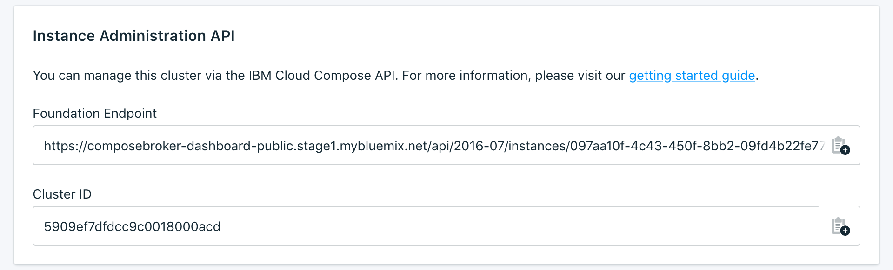

---

Copyright:
  Years: 2017, 2018
lastupdated: "2018-02-19"
---

{:new_window: target="_blank"}
{:shortdesc: .shortdesc}
{:screen: .screen}
{:codeblock: .codeblock}
{:pre: .pre}

# Dashboard Overview
{: #dashboard-overview}

You can manage your {{site.data.keyword.composeEnterprise_full}} service from the service dashboard.

## Cluster Details

The _Cluster Details_ panel shows details of your {{site.data.keyword.composeEnterprise}} cluster.

### Name

An internal identifier for the cluster.

### Type

Other Compose {{site.data.keyword.cloud_notm}} services use this field to show the type of database that is offered by the service, and the database version that your service uses. For a {{site.data.keyword.composeEnterprise}} service, the value is always _Enterprise Cluster_.

### Status

The status of your {{site.data.keyword.composeEnterprise}} cluster.

### Region

The {{site.data.keyword.cloud_notm}} region that the {{site.data.keyword.composeEnterprise}} cluster resides in.

## Instance Administration API

You can manage your {{site.data.keyword.composeForElasticsearch}} service through the {{site.data.keyword.cloud_notm}} Compose API.

### Foundation Endpoint

The foundation endpoint is composed of the region the cluster resides in and the cluster ID. It can be found at the start of every endpoint.

### Cluster ID

The cluster ID is necessary for most calls, and identifies the specific deployment instance.

### Reference

For more documentation and reference for using the {{site.data.keyword.cloud_notm}} Compose API, across all {{site.data.keyword.cloud_notm}} Compose services, read [The {{site.data.keyword.cloud_notm}} Compose API](https://www.compose.com/articles/the-ibm-cloud-compose-api/).
