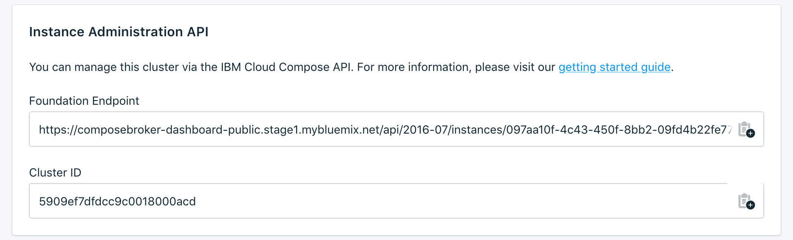

---

Copyright:
  Years: 2017, 2018
lastupdated: "2018-01-30"
---

{:new_window: target="_blank"}
{:shortdesc: .shortdesc}
{:screen: .screen}
{:codeblock: .codeblock}
{:pre: .pre}

# Übersicht über das Dashboard

Sie können Ihren {{site.data.keyword.composeEnterprise_full}}-Service über das Service-Dashboard verwalten.

## Clusterdetails

Die Anzeige _Clusterdetails_ enthält Details zu Ihrem {{site.data.keyword.composeEnterprise}}-Cluster.

### Name

Eine interne ID für den Cluster.

### Typ

Andere {{site.data.keyword.cloud_notm}} Compose-Services verwenden dieses Feld zum Anzeigen des Datenbanktyps, der vom Service angeboten wird, und der Datenbankversion, die Ihr Service verwendet. Für einen {{site.data.keyword.composeEnterprise}}-Service ist dieser Wert immer _Enterprise Cluster_.

### Status

Der Status Ihres {{site.data.keyword.composeEnterprise}}-Clusters.

### Region

Die {{site.data.keyword.cloud_notm}}-Region, in der sich der {{site.data.keyword.composeEnterprise}}-Cluster befindet.

## Instanzverwaltungs-API

Sie können Ihren {{site.data.keyword.composeForElasticsearch}}-Service über die {{site.data.keyword.cloud_notm}} Compose-API verwalten.

### Basisendpunkt

Der Basisendpunkt setzt sich aus der Region, in der sich der Cluster befindet, und der Cluster-ID zusammen. Er befindet sich am Anfang von jedem Endpunkt.

### Cluster-ID

Die Cluster-ID wird für die meisten Aufrufe benötigt und gibt eine bestimmte Bereitstellungsinstanz an.

### Referenz

Zusätzliche Dokumentation und Referenz zur Verwendung der {{site.data.keyword.cloud_notm}} Compose-API für alle {{site.data.keyword.cloud_notm}} Compose-Services finden Sie in [Die {{site.data.keyword.cloud_notm}} Compose-API](https://www.compose.com/articles/the-ibm-cloud-compose-api/).
