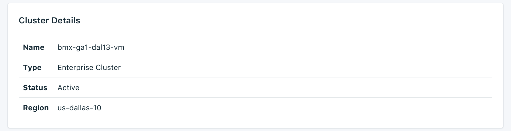

---

Copyright:
  Years: 2017, 2018
lastupdated: "2018-01-30"
---

{:new_window: target="_blank"}
{:shortdesc: .shortdesc}
{:screen: .screen}
{:codeblock: .codeblock}
{:pre: .pre}

# Présentation du tableau de bord

Vous pouvez gérer votre service {{site.data.keyword.composeEnterprise_full}} depuis son tableau de bord.

## Détails de cluster

Le panneau _Cluster Details_ affiche des détails concernant votre cluster {{site.data.keyword.composeEnterprise}}.

### Nom

Identificateur interne du cluster.

### Type

D'autres services Compose {{site.data.keyword.cloud_notm}} utilisent cette zone pour afficher le type de base de données fourni par le service et la version de base de données qu'utilise votre service. Pour un service {{site.data.keyword.composeEnterprise}}, la valeur est toujours _Enterprise Cluster_.

### Statut

Statut de votre cluster {{site.data.keyword.composeEnterprise}}.

### Région

Région {{site.data.keyword.cloud_notm}} dans laquelle réside le cluster {{site.data.keyword.composeEnterprise}}.

## API d'administration d'instance

Vous pouvez gérer votre service {{site.data.keyword.composeForElasticsearch}} via l'API {{site.data.keyword.cloud_notm}} Compose.

### Noeud final Foundation

Le noeud final Foundation est composé de la région où réside le cluster et de l'ID de cluster. Il se trouve au début de chaque noeud final.

### Cluster ID

ID du cluster, nécessaire pour la plupart des appels et qui identifie l'instance de déploiement spécifique.

### Référence

Pour plus de documentation et de référence sur l'utilisation de l'API {{site.data.keyword.cloud_notm}} Compose au sein de tous les services {{site.data.keyword.cloud_notm}} Compose, voir [API {{site.data.keyword.cloud_notm}} Compose](https://www.compose.com/articles/the-ibm-cloud-compose-api/).
