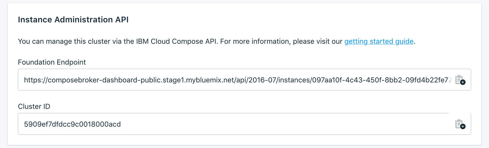

---

Copyright:
  Years: 2017, 2018
lastupdated: "2018-02-19"
---

{:new_window: target="_blank"}
{:shortdesc: .shortdesc}
{:screen: .screen}
{:codeblock: .codeblock}
{:pre: .pre}

# Visão geral do painel

É possível gerenciar seu serviço {{site.data.keyword.composeEnterprise_full}} do painel de serviço.

## Detalhes do cluster

O painel _Detalhes do cluster_ mostra detalhes do cluster do {{site.data.keyword.composeEnterprise}}.

### Nome

Um identificador interno para o cluster.

### Tipo

Outros serviços do Compose {{site.data.keyword.cloud_notm}} usam esse campo para mostrar o tipo de banco de dados oferecido pelo serviço e a versão do banco de dados usada por seu serviço. Para um serviço {{site.data.keyword.composeEnterprise}}, o valor é sempre _Enterprise Cluster_.

### Status

O status do cluster do {{site.data.keyword.composeEnterprise}}.

### Region

A região do {{site.data.keyword.cloud_notm}} na qual o cluster do {{site.data.keyword.composeEnterprise}} reside.

## API de administração de instância

É possível gerenciar o serviço {{site.data.keyword.composeForElasticsearch}} por meio da API do {{site.data.keyword.cloud_notm}} Compose.

### Terminal de base

O terminal de base é composto pela região na qual o cluster reside e pelo ID do cluster. Ele pode ser localizado no início de cada terminal.

### ID do cluster

O ID do cluster é necessário para a maioria das chamadas e identifica a instância de implementação específica.

### Referência

Para obter mais documentação e referência para usar a API Compose do {{site.data.keyword.cloud_notm}}, ao longo de todos os serviços Compose do {{site.data.keyword.cloud_notm}}, leia [A API Compose do {{site.data.keyword.cloud_notm}}](https://www.compose.com/articles/the-ibm-cloud-compose-api/).
